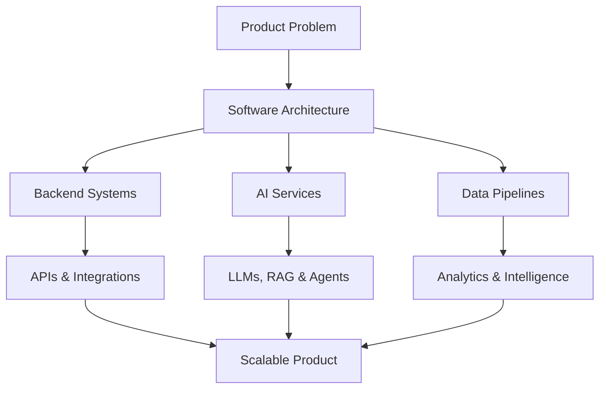

<div align="center">


<br>


</div>

---


# 👩‍💻 About Me

Software Engineer with 10+ years of experience in software development, software architecture, AI applications and data-driven systems.

Focused on building scalable backend systems, enterprise architectures, intelligent automations and modern AI-powered applications.

---

# 🇧🇷 Sobre Mim

Engenheira de Software com mais de 10 anos de experiência em desenvolvimento de sistemas, arquitetura de software, aplicações com IA e soluções orientadas a dados.

Atuação focada em arquiteturas escaláveis, backend engineering, automações inteligentes e produtos modernos com IA aplicada.

---

# 🚀 Core Positioning | 🚀 Posicionamento Central

```txt
AI Engineering • Software Architecture • Backend Engineering • Enterprise Systems
```

---
# ⚡ Tech Stack | ⚡ Conjunto de tecnologias

## Backend Engineering | Engenharia de Backend


---

## Architecture & Engineering | Arquitetura e Engenharia


---

## AI & Data | IA e Dados


---

## Databases | Bancos de dados


---

## Frontend


---

## Infrastructure & DevOps | Infraestrutura e DevOps


---

## Leadership & Delivery | Liderança e Entrega


---
# 🧠 Featured Projects | Projetos em Destaque

<table>

<tr>

<td width="50%" valign="top">

## 🚀 AtendeAI

### 🇺🇸 AI Customer Service Platform

AI-powered customer service platform with intelligent automation, conversational workflows and multi-channel integrations.

### 🇧🇷 Plataforma de Atendimento com IA

Plataforma inteligente de atendimento automatizado com IA generativa, automação de fluxos e integração multicanal.

**Stack:**  
`AI` `Automation` `Chatbots` `Workflows` `SaaS`

</td>

<td width="50%" valign="top">

## 🧠 AgentBench

### 🇺🇸 Generative AI Research Lab

Experimental environment focused on prompt engineering, autonomous agents, RAG pipelines and AI benchmarking.

### 🇧🇷 Laboratório de Pesquisa em IA Generativa

Ambiente experimental focado em engenharia de prompts, agentes autônomos, pipelines RAG e benchmarking de IA.

**Stack:**  
`GenAI` `RAG` `Agents` `Embeddings` `Benchmarks`

</td>

</tr>

<tr>

<td width="50%" valign="top">

## 🏗️ HexaStack

### 🇺🇸 Enterprise Architecture Boilerplate

Production-ready backend architecture template using Clean Architecture, observability and microservices patterns.

### 🇧🇷 Boilerplate de Arquitetura Enterprise

Template backend pronto para produção utilizando Clean Architecture, observabilidade e padrões de microsserviços.

**Stack:**  
`Architecture` `Microservices` `CI/CD` `Docker` `Observability`

</td>

<td width="50%" valign="top">

## ⚙️ FlowMind

### 🇺🇸 AI Workflow Automation Platform

Intelligent workflow automation system for enterprise operations using AI agents and event-driven processing.

### 🇧🇷 Plataforma de Automação Inteligente

Sistema de automação de workflows empresariais utilizando agentes de IA e processamento orientado a eventos.

**Stack:**  
`Automation` `AI Agents` `Events` `Workflows` `Enterprise`

</td>

</tr>

<tr>

<td width="50%" valign="top">

## 🎯 AffinityAI

### 🇺🇸 AI Recommendation Engine

Machine learning recommendation engine powered by behavioral analytics and scalable inference APIs.

### 🇧🇷 Motor de Recomendação com IA

Sistema inteligente de recomendação baseado em machine learning e análise comportamental.

**Stack:**  
`Machine Learning` `Recommendations` `Analytics` `Inference APIs`

</td>

<td width="50%" valign="top">

## 📡 VectorOps

### 🇺🇸 Observability & Distributed Monitoring Platform

Real-time platform for logs, metrics, tracing and infrastructure monitoring.

### 🇧🇷 Plataforma de Observabilidade Distribuída

Plataforma em tempo real para logs, métricas, tracing e monitoramento de infraestrutura.

**Stack:**  
`Observability` `Tracing` `Metrics` `Monitoring` `Logs`

</td>

</tr>

</table>

---

# 🏛️ Architecture Mindset | 🏛️ Mentalidade de Arquitetura




---

# 🎯 Current Focus | 🎯 Foco atual

- AI Engineering
- Generative AI
- LLM Applications
- RAG Architectures
- Autonomous Agents
- Distributed Systems
- Backend Scalability
- Software Architecture
- Intelligent Automation
- Enterprise Solutions
- Observability
- Data-driven Products

---

# 🏆 GitHub Trophies | 🏆 Troféus do GitHub

<div align="center">


</div>

---

# 📊 GitHub Metrics | 📊 Métricas do GitHub

<div align="center">


</div>

<div align="center">


</div>

---

# 🐍 Contribution Activity | 🐍 Atividade de Contribuição

<div align="center">


</div>

---

# 💡 Engineering Philosophy | 💡 Filosofia da Engenharia

> Clean architecture, scalable systems and AI-driven solutions built with long-term maintainability in mind.
> 🇧🇷 Arquitetura limpa, sistemas escaláveis ​​e soluções orientadas por IA, construídas com foco na manutenção a longo prazo.

---

# 🧩 Areas of Expertise | 🧩 Áreas de especialização

```txt
Software Engineering      Software Architecture      Backend Engineering
AI Engineering            Data Engineering           Distributed Systems
API Design                Event-Driven Architecture  Automation Platforms
Enterprise Systems        Observability              Machine Learning
Generative AI             Cloud Solutions            Product Engineering
```
```txt
🇧🇷
Engenharia de Software Arquitetura de Sistemas Engenharia Backend
Engenharia de IA Engenharia de Dados Sistemas Distribuídos
Design de APIs Arquitetura Orientada a Eventos
Plataformas de Automação Observabilidade Machine Learning
IA Generativa Soluções Cloud Engenharia de Produtos
```
---

# 🌐 Connect With Me | 🌐 Conecte-se comigo

<div align="center">

[](https://linkedin.com/thayribeirom)

[](https://github.com/thayribeirom)

</div>

---

<div align="center">


</div>
